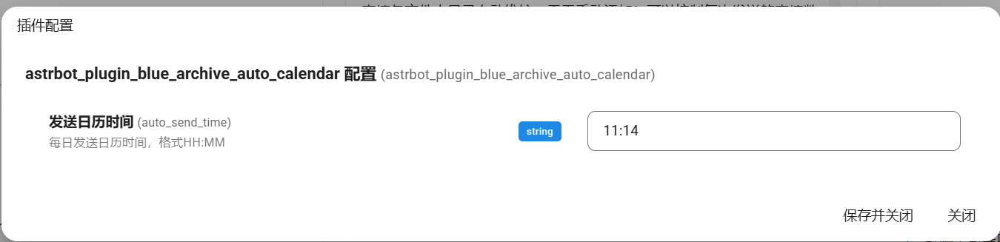

<h1 style="text-align:center; font-size: 2em; color: #4A90E2; margin-top: 20px;">
    自动发送ba日历插件
</h1>

## 觉得有用可以点个star⭐喵😭

## 功能特色
-  **定时发送日历**: 📅 每日定时自动发送目标群组的日历。
-  **服务器选择**: 🌐 可以为每个群聊自定义发送的服务器日历。
-  **可靠的数据源**: 🔍 使用gamekee和SchaleDB公共数据库，提供准确而可靠的数据。
-  **即时查询功能**: ⌛ 输入`/日历 [服务器名]`即可快速获取并发送指定服务器的日历。

## 效果展示

## 配置项目
| 配置项  | 说明         | 备注         |
|------------------------|-----------------|----------------------|
| 发送日历时间       | 每日发送日历时间，格式HH:MM | 使用东八区基准，默认为早上9点 |

## 使用方法
1. 下载插件

2. 在控制面板进入配置项，配置发送时间

3. 在群聊中使用"/日历 [服务器名(cn/jp/global)]"来启用本会话的的日历推送，服务器可以为cn、jp、global，使用'/'分割，例如'/启用日历 jp/global/cn'
4. 如果要禁用则使用'/禁用日历'来禁用本会话的日历推送

## 使用注意事项
- 数据切换：gamekee 出现问题时会自动切换到 SchaleDB 数据库，此时会缺少大决战数据（因为修这个查询函数好麻烦我还找不到这个数据库的说明文档😭）。

## 🙏 致谢
- 本项目参考了[astrbot-qq-group-daily-analysis](https://github.com/SXP-Simon/astrbot-qq-group-daily-analysis/)的定时调度和消息平台处理
- 查询逻辑来自隔壁的HoshinoBot插件
[Blue_Archive_HoshinoBot](https://github.com/Cosmos01/Blue_Archive_HoshinoBot)，该项目似乎由于SchaleDB的数据格式更新所以对SchaleDB查询存在问题，而且英文wiki更新了反爬虫导致查询失效，我修补了一下，不过只要gamekee不出问题应该就没事
- 数据来源：[gamekee](https://www.gamekee.com/ba/)，[SchaleDBs](https://schaledb.com/home) 

## 后续更新计划
- [ ] 添加活动结束提醒功能
- [ ] 加入cron格式时间
- [ ] 添加项目数据流图
- [ ] 添加错误处理

## 更新日志

### 2025-10-21
v1.0
- 推送正式版本

v1.14
- 更新了umo的持久化表达
- 修正了发送函数中的umo组合错误